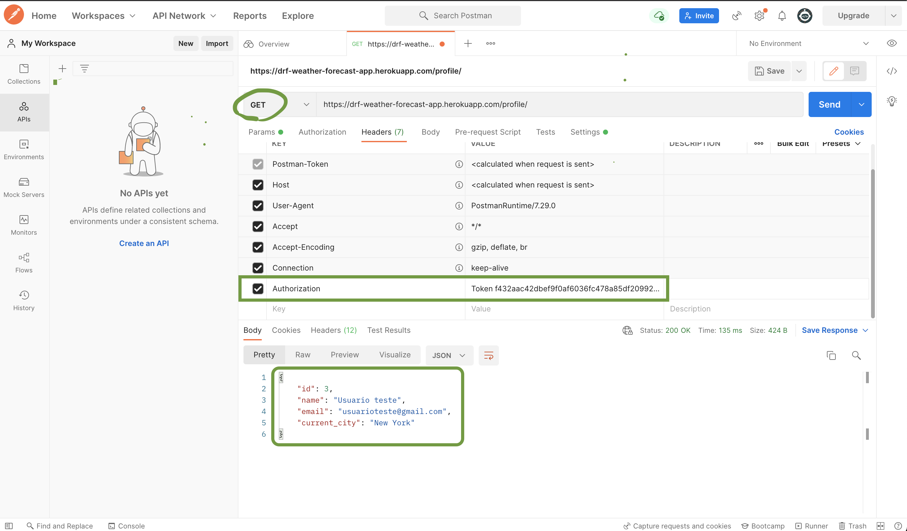
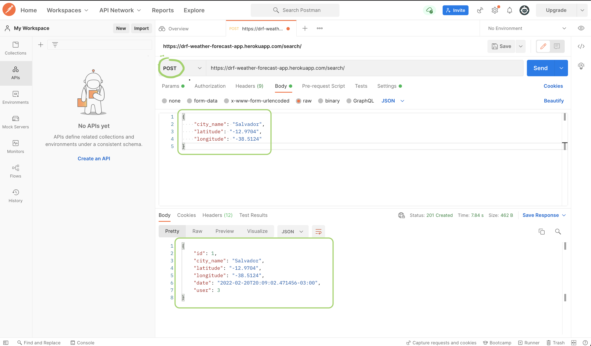
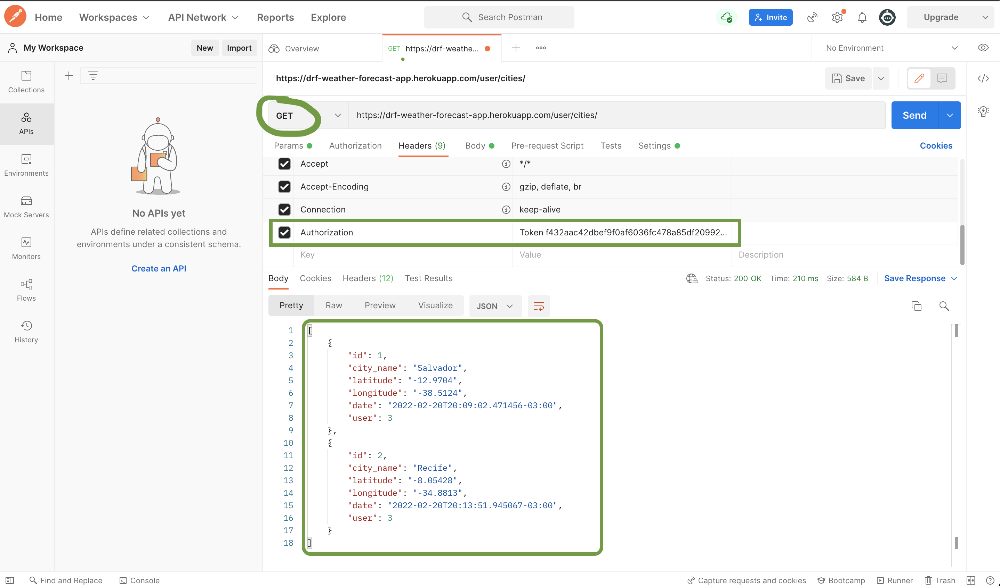

<h1 align="center">
  Weather Forecast API
</h1>

<h3 align="center">>
  Essa API tem como intuito o registro de usuários e de pesquisas feitas por eles. Nessas pesquisas o foco foi o registro de cidades e suas respectivas latitudes e longitudes, para serem usadas no projeto https://github.com/JoseCarlos33/weather-forecast-app-react-native
</h3>

### Deploy

```
  https://drf-weather-forecast-app.herokuapp.com/
```
### Features

- [x] Cadastro de usuário
- [x] Login de usuário
- [x] Listar perfil do usuário logado
- [x] Registrar pesquisas do usuário
- [x] Buscar pesquisas do usuário
### Endpoints

```
  Login : 
    - Link do deploy: https://drf-weather-forecast-app.herokuapp.com/login/
    - Rodando Localmente: http://127.0.0.1:8000/login/
    - Método HTTP: POST

  Cadastro: 
    - Link do deploy: https://drf-weather-forecast-app.herokuapp.com/register/
    - Rodando Localmente: http://127.0.0.1:8000/register/
    - Métodos HTTP: POST

  Registrar Pesquisas do Usuário Logado:
    - Link do deploy: https://drf-weather-forecast-app.herokuapp.com/search/
    - Rodando Localmente: http://127.0.0.1:8000/search/
    - Métodos HTTP: POST

  Listar Pesquisas do Usuário Logado:
    - Link do deploy: https://drf-weather-forecast-app.herokuapp.com/user/cities/
    - Rodando Localmente: http://127.0.0.1:8000/user/cities/
    - Métodos HTTP: GET

  Listar Perfil do Usuário Logado:
    - Link do deploy: https://drf-weather-forecast-app.herokuapp.com/profile/
    - Rodando Localmente: http://127.0.0.1:8000/profile/
    - Métodos HTTP: GET
```

### Requisições e respostas

```
  Login:

    Requisição POST:
      {
        "email": "usuarioteste@gmail.com"
        "password": "teste"
      }

    Resposta da Requisição:
      {
        "token": "3arrtt95c888889de125bae1091872aea2454522ddfaa1455" # <- token do usuário 
      }

    Obs.: Esse token será necessário passar no header das requisições dos endpoints associados 
    ao usuário logado!
```
```
  Cadastro:

    Requisição POST:
      {
        "name": "Usuario teste",
        "email": "usuarioteste1@gmail.com",
        "current_city": "New York",
        "password": "teste"
      }

    Resposta da requisição: 
      {
        "name": "Usuario teste",
        "email": "usuarioteste1@gmail.com",
        "current_city": "New York"
      }
```
```
  Listar Perfil do Usuário Logado:

    Requisição GET e resposta (utilizando o postman):
```


```
  Registrar Pesquisas do Usuário Logado:

    Requisição POST e resposta (utilizando o postman):
```


```
  Listar Pesquisas do Usuário Logado:

    Requisição GET e resposta (utilizando o postman):
```


### Autor

**José Carlos Noronha**